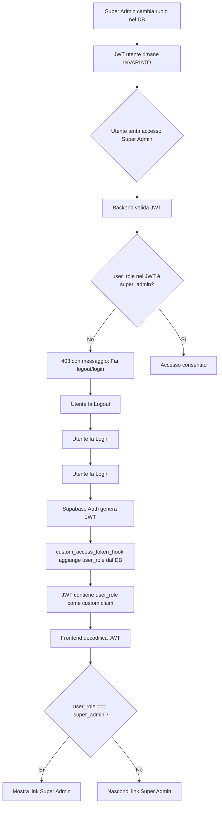

# 🔄 Gestione Cambio Ruolo Utente - Guida Tecnica

## 📋 Panoramica

Questo documento descrive come funziona il cambio di ruolo utente nel sistema Guardian AI CRM e come è stata risolta l'issue del "Failed to fetch" quando si passa da un account normale a super admin.

**Data Fix:** 2025-01-20  
**Issue:** Errore "Failed to fetch" quando si accede alla dashboard super admin dopo un cambio di ruolo

---

## 🐛 Problema Originale

### Scenario
1. Utente fa login come utente normale
2. Un super admin cambia il ruolo dell'utente da `user` a `super_admin` nel database
3. L'utente clicca sul link "Super Admin" nella sidebar
4. Frontend chiama `superadmin-dashboard-stats` con il vecchio JWT
5. Backend rifiuta la richiesta con 403 (JWT ha ancora `user_role: 'user'`)
6. Si verifica errore "Failed to fetch" invece di un messaggio chiaro

### Causa Radice
Il JWT token contiene il ruolo dell'utente come custom claim (`user_role`), che viene aggiunto al momento del login dal `custom_access_token_hook`. Quando il ruolo viene modificato nel database, il JWT esistente NON viene aggiornato automaticamente. L'utente deve:
- Fare logout e login nuovamente, OPPURE
- Aspettare che il token venga automaticamente refreshato (ogni ~1 ora)

---

## ✅ Soluzione Implementata

### 1. Backend: CORS Headers su Tutti gli Errori

**File:** `supabase/functions/_shared/superadmin.ts`

Prima, le risposte di errore non includevano i CORS headers, causando il browser a bloccare la risposta con un errore generico "Failed to fetch".

**Fix:**
```typescript
export function createSuperAdminErrorResponse(
  message: string, 
  statusCode: number = 403,
  diagnostics?: Record<string, any>
): Response {
  // ... logica esistente ...
  
  // AGGIUNTO: CORS headers
  const corsHeaders = {
    "Access-Control-Allow-Origin": "*",
    "Access-Control-Allow-Headers": "authorization, x-client-info, apikey, content-type, x-n8n-api-key",
    "Access-Control-Allow-Methods": "POST, GET, OPTIONS",
  };
  
  return new Response(
    JSON.stringify(responseBody),
    {
      status: statusCode,
      headers: { 
        'Content-Type': 'application/json',
        ...corsHeaders  // ✅ Ora incluso in TUTTE le risposte
      },
    }
  );
}
```

**Risultato:** Il browser ora può leggere correttamente la risposta di errore e mostrare un messaggio appropriato all'utente.

---

### 2. Backend: Messaggi di Errore Più Chiari

**File:** `supabase/functions/_shared/superadmin.ts`

Migliorati i messaggi di errore per guidare l'utente alla soluzione:

**Quando `user_role` claim manca dal JWT:**
```typescript
error: 'JWT custom claim user_role not found. Please logout and login again to refresh your session.'
```

**Quando ruolo non è super_admin:**
```typescript
error: 'Access denied. Super Admin role required. Your current role is: ${userRole}. Please logout and login again if your role was recently changed.'
```

**Risultato:** Gli utenti ora ricevono istruzioni chiare su cosa fare.

---

### 3. Frontend: Detection Migliorata degli Errori JWT

**File:** `src/lib/api.ts`

Il frontend ora rileva automaticamente errori legati a JWT obsoleti e mostra un prompt per fare logout/login:

```typescript
const isJwtClaimError = (response.status === 403 || response.status === 401) && 
                       /user_role not found|JWT custom claim|custom claim.*not found|logout and login again|Please logout and login|role was recently changed/i.test(errorMessage);

if (isJwtClaimError) {
    // Mostra toast con pulsante "Vai al Login"
    showErrorToast(userMessage, diagnosticReport, { 
        requiresLogout: true,
        isJwtError: true 
    });
    
    // Pulisce local storage
    localStorage.removeItem('organization_id');
    
    throw { 
        error: userMessage, 
        isJwtError: true,
        requiresRelogin: true 
    };
}
```

**Risultato:** L'utente vede un messaggio chiaro con un pulsante per fare logout e login.

---

### 4. Frontend: Visualizzazione Condizionale del Link Super Admin

**File:** `src/components/Sidebar.tsx`

Il link "Super Admin" nella sidebar ora appare SOLO se il JWT contiene `user_role: 'super_admin'`:

```typescript
const [isSuperAdmin, setIsSuperAdmin] = useState(false);

useEffect(() => {
  const checkSuperAdminRole = async () => {
    const { data: { session } } = await supabase.auth.getSession();
    if (session?.access_token) {
      const diagnostics = diagnoseJWT(session.access_token);
      if (diagnostics.claims?.user_role === 'super_admin') {
        setIsSuperAdmin(true);
      }
    }
  };

  checkSuperAdminRole();

  // Listener per aggiornamenti auth (login, token refresh, logout)
  const { data: { subscription } } = supabase.auth.onAuthStateChange(async (event, session) => {
    if (event === 'SIGNED_IN' || event === 'TOKEN_REFRESHED') {
      if (session?.access_token) {
        const diagnostics = diagnoseJWT(session.access_token);
        setIsSuperAdmin(diagnostics.claims?.user_role === 'super_admin');
      }
    } else if (event === 'SIGNED_OUT') {
      setIsSuperAdmin(false);
    }
  });

  return () => subscription.unsubscribe();
}, []);

// Nel render:
{isSuperAdmin && (
  <NavItem
      to="/super-admin"
      icon={<AdminPanelIcon className="w-6 h-6" />}
      label="Super Admin"
  />
)}
```

**Risultato:** Gli utenti non vedono il link Super Admin finché non hanno effettivamente il ruolo nel loro JWT.

---

## 🔧 Procedura Operativa per Cambio Ruolo

### Per Super Admin che Cambiano Ruoli

Quando un super admin cambia il ruolo di un utente:

1. **Usa la funzione `superadmin-update-user`** per aggiornare il campo `role` nel database
2. **Informa l'utente** che deve fare logout e login per attivare il nuovo ruolo
3. Alternativamente, l'utente può aspettare il refresh automatico del token (~1 ora)

### Per Utenti che Ricevono Super Admin

Se ricevi il ruolo super_admin:

1. **Fai logout** dal sistema
2. **Fai login** nuovamente
3. Il nuovo JWT conterrà `user_role: 'super_admin'`
4. Il link "Super Admin" apparirà automaticamente nella sidebar
5. Ora puoi accedere alla dashboard super admin

---

## 🧪 Testing

### Test Manuale

1. **Login come utente normale:**
   ```
   - Il link "Super Admin" NON dovrebbe essere visibile nella sidebar
   - Se si tenta di accedere a /super-admin manualmente, si ottiene 403
   ```

2. **Cambio ruolo a super_admin (tramite altro super admin):**
   ```
   - Il link "Super Admin" ancora NON è visibile (JWT non aggiornato)
   - Se si tenta di accedere a /super-admin, si ottiene un errore con messaggio chiaro
   ```

3. **Logout e login:**
   ```
   - Il link "Super Admin" ORA è visibile
   - Cliccando sul link, la dashboard carica correttamente
   ```

### Verifica JWT

Per verificare che il JWT contenga il custom claim corretto:

```typescript
import { diagnoseJWT } from './lib/jwtUtils';
import { supabase } from './lib/supabaseClient';

const { data: { session } } = await supabase.auth.getSession();
const diagnostics = diagnoseJWT(session.access_token);

console.log('Has user_role:', diagnostics.hasUserRole);
console.log('User role:', diagnostics.claims?.user_role);
```

---

## 📊 Flusso di Autenticazione e Ruoli



---

## 🔐 Sicurezza

### Perché il JWT Non Si Aggiorna Automaticamente?

Il JWT è **crittograficamente firmato** da Supabase Auth al momento della generazione. Non può essere modificato lato client o backend senza invalidarlo. I custom claims vengono aggiunti solo durante:

1. **Nuovo login** (generazione nuovo token)
2. **Token refresh** (generazione nuovo token con claims aggiornati)
3. **Manuale via `supabase.auth.refreshSession()`**

Questo è un comportamento **intenzionale per sicurezza**:
- Previene manomissioni del ruolo lato client
- Garantisce che il ruolo sia sempre sincronizzato con il database al momento della generazione del token
- Il ruolo è firmato crittograficamente e verificabile dal backend

### Possibile Miglioramento Futuro

Se è critico che i ruoli si aggiornino immediatamente, si potrebbe:

1. **Forzare refresh del token quando il ruolo cambia:**
   ```typescript
   // Dopo aver cambiato il ruolo nel DB
   await supabase.auth.refreshSession();
   ```

2. **Notifica push all'utente** via WebSocket quando il ruolo cambia, suggerendo di refreshare la pagina

3. **Auto-refresh periodico del token** ogni 5-10 minuti invece di ogni ora

---

## 📚 Riferimenti

- [JWT Custom Claims Implementation Guide](./JWT_CUSTOM_CLAIMS_IMPLEMENTATION.md)
- [Super Admin Implementation](./SUPER_ADMIN_IMPLEMENTATION.md)
- [Supabase Auth Hooks Documentation](https://supabase.com/docs/guides/auth/auth-hooks)

---

## 🎯 Checklist di Verifica

Dopo un cambio di ruolo, verifica che:

- [ ] Il ruolo sia stato aggiornato nel database (`profiles.role`)
- [ ] L'utente sia stato informato di fare logout/login
- [ ] Dopo il login, il JWT contiene il nuovo `user_role`
- [ ] La sidebar mostra/nasconde il link Super Admin correttamente
- [ ] L'accesso alla dashboard super admin funziona
- [ ] Non ci sono errori "Failed to fetch" nella console

---

**Autore:** GitHub Copilot + Team Guardian AI CRM  
**Ultima Modifica:** 2025-01-20
